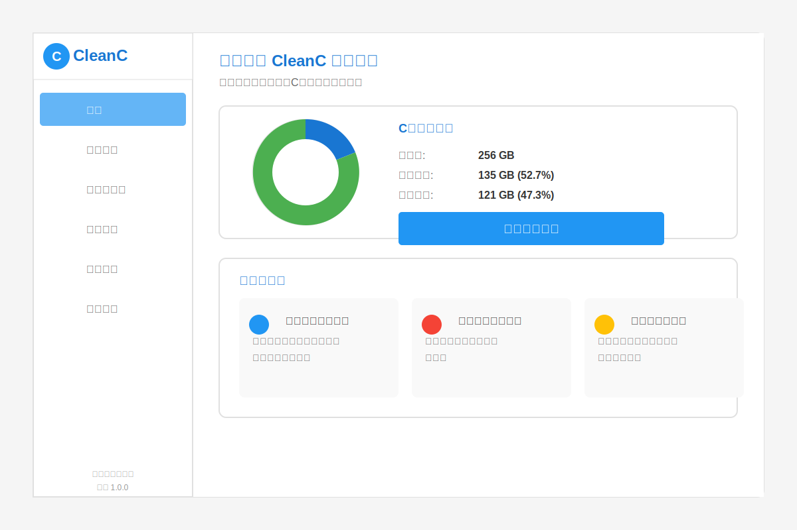

# CleanC - Ultimate C Drive Cleaner for Beginners

<div align="center">


**A Simple & Safe Windows System Cleaner Designed for Non-Technical Users**

[](https://opensource.org/licenses/MIT)
[](https://github.com/junhe421/CleanC)
[](https://github.com/junhe421/CleanC)
[](https://www.electronjs.org/)

[中文版本](README_CN.md) | [Features](#features) | [Installation](#installation) | [Usage](#usage) | [Contributing](#contributing)

</div>

## Overview

CleanC is a beginner-friendly Windows system cleaner specifically designed for users with no technical background. It provides a faster, more intuitive experience than other similar products available in the market, allowing users to safely and easily manage and free up C drive space.

**Powered by Next Wave Technology**



## Features

### 🔍 Smart Scanning & Safety Classification
- **High-speed scanning engine** for rapid C drive analysis
- **Clear graphical interface** displaying scan results
- **Automatic safety level classification** ("Safe to Clean", "Recommended to Keep", "System Critical Files")
- **Plain language explanations** to prevent accidental operations

### ⚡ One-Click Quick Cleanup
- **Prominent and simple** "One-Click Clean" button
- **Default selection** of only files marked as "Safe to Clean"
- **Lightning-fast response** and space liberation

### 🛠️ C Drive Management Assistant
- **Large File Finder**: Lists files that consume the most space for user review
- **Duplicate File Finder**: Identifies identical files with simple cleanup options
- **Easy Program Uninstaller**: More thorough and clear than system built-in uninstaller
- **Startup Accelerator**: Simple toggle switches to manage startup programs and speed up boot time

## Technical Highlights

- **Electron Framework**: Ensures high performance and cross-platform compatibility
- **Optimized File Scanning Algorithm**: Provides best-in-class performance
- **Clean and Intuitive UI**: Specifically designed for non-technical users
- **Built-in Safety Mechanisms**: Prevents accidental deletion of important files

## Installation

### System Requirements
- Windows 10/11 (64-bit)
- Minimum RAM: 4GB
- Disk Space: 100MB free space
- Administrator privileges (for system cleaning operations)

### Quick Start
1. Download the latest CleanC installer from [Releases](https://github.com/junhe421/CleanC/releases)
2. Double-click the installer to run the setup program
3. Follow the on-screen instructions to complete installation
4. Launch CleanC from the desktop shortcut

## Usage

### Quick Start Guide
1. Launch the CleanC application
2. Main interface displays current C drive usage
3. Click "Start System Scan" to perform full disk scan
4. After scanning, select items you want to clean
5. Click "Clean Selected Items" to begin cleanup

### Advanced Features
- **Find Large Files**: Select "Large File Finder" from left menu, set minimum file size and click search
- **Find Duplicate Files**: Select "Duplicate Files" from left menu, choose directories to scan and click search
- **Manage Startup Programs**: Select "Startup Accelerator" from left menu, use toggle switches to control application auto-start

## Development

### Development Environment
- Node.js 18+
- Electron 28+
- Windows development environment

### Getting Started

```bash
# Clone the repository
git clone https://github.com/junhe421/CleanC.git
cd CleanC

# Install dependencies
npm install

# Start development version
npm start

# Build production version
npm run build

# Create installer
npm run build:installer
```

### Project Structure

```
CleanC/
├── src/                    # Source code
│   ├── js/                # JavaScript modules
│   └── css/               # Stylesheets
├── assets/                # Application assets
├── tests/                 # Test suites
├── docs/                  # Documentation
├── main.js               # Electron main process
├── index.html            # Main application window
└── package.json          # Project configuration
```

### Testing

```bash
# Run all tests
npm test

# Run specific test suites
npm run test:main         # Main process tests
npm run test:renderer     # Renderer process tests
npm run test:e2e          # End-to-end tests
```

## About Next Wave

Next Wave is a technology company focused on innovative software solutions, committed to creating applications that are both simple to use and powerful. We believe technology should make life simpler, not more complicated.

Through tools like CleanC, we hope to help users who aren't very familiar with computers to easily manage their devices and enjoy a smooth user experience.

## Version History

### Version 1.0.0 (Current)
- Initial release
- Basic C drive cleaning functionality
- Large file finder support
- Program uninstall management
- Startup program management

## Contributing

We welcome contributions! Please see our [Contributing Guide](CONTRIBUTING.md) for details.

1. Fork the Project
2. Create your Feature Branch (`git checkout -b feature/AmazingFeature`)
3. Commit your Changes (`git commit -m 'Add some AmazingFeature'`)
4. Push to the Branch (`git push origin feature/AmazingFeature`)
5. Open a Pull Request

## Privacy Policy

CleanC respects user privacy and does not collect any personal data. All scanning and cleaning operations are performed locally and no files or usage data are uploaded to external servers.

## License

This project is licensed under the MIT License - see the [LICENSE](LICENSE) file for details.

## Contact

If you have any questions or suggestions, please contact us through:

- **QQ Group**: 960598442
- **Email**: junhe421@gmail.com
- **Project Homepage**: https://github.com/junhe421/CleanC

## WeChat Official Account

Follow our WeChat official account for more computer tips and CleanC updates:

<div align="center">


</div>

---

<div align="center">

**CleanC** - Making Computer Cleanup Simple © 2025 Next Wave

⭐ If you find this project helpful, please give it a star!

</div> 